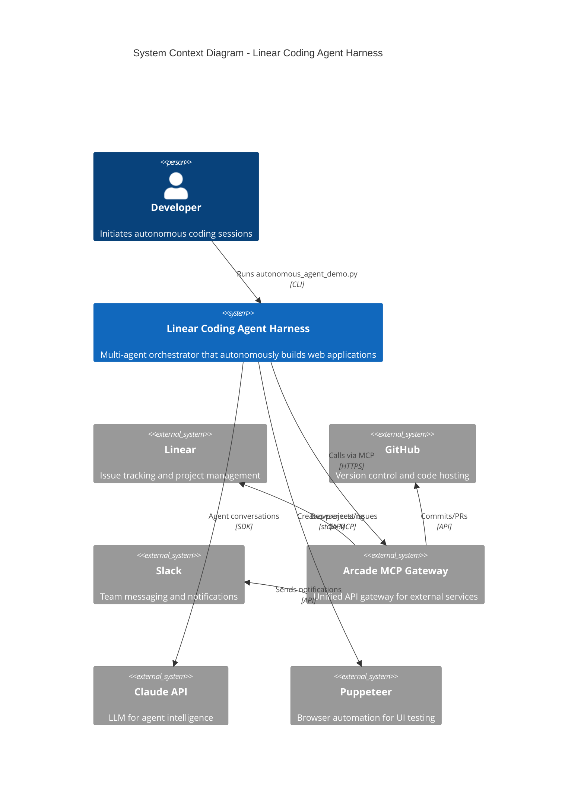
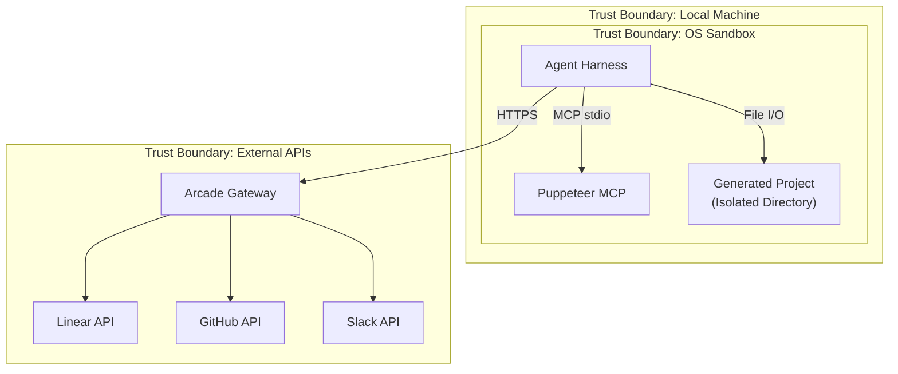

# System Context

## Overview

The Linear-Coding-Agent-Harness is a multi-agent orchestrator system built on the Claude Agent SDK. It autonomously builds web applications by coordinating specialized agents (Linear, Coding, GitHub, Slack) through a central orchestrator, with all work tracked in Linear.

## System Context Diagram

## Stakeholders

| Stakeholder | Role | Concerns |
|-------------|------|----------|
| Developer | Primary user | Autonomous code generation, progress visibility |
| Product Owner | Work requestor | Feature completion, Linear tracking |
| DevOps | Infrastructure | Security, resource usage, sandboxing |

## External Systems

### Linear (Required)

- **Purpose**: Project and issue management
- **Integration**: Via Arcade MCP Gateway
- **Operations**: Create projects, issues, comments; manage status transitions
- **State Tracking**: `.linear_project.json` stores project IDs

### GitHub (Optional)

- **Purpose**: Version control and code hosting
- **Integration**: Via Arcade MCP Gateway
- **Operations**: Create branches, commits, pull requests
- **Activation**: Set `GITHUB_REPO=owner/repo` environment variable

### Slack (Optional)

- **Purpose**: Team notifications
- **Integration**: Via Arcade MCP Gateway
- **Operations**: Send messages to channels
- **Activation**: Set `SLACK_CHANNEL=channel-name` environment variable
- **Limitation**: Cannot create channels; must use existing

### Arcade MCP Gateway

- **Purpose**: Unified API gateway providing MCP access to Linear, GitHub, Slack
- **Authentication**: Bearer token (ARCADE_API_KEY)
- **URL Pattern**: `https://api.arcade.dev/mcp/{ARCADE_GATEWAY_SLUG}`

### Claude Agent SDK

- **Purpose**: LLM orchestration and agent infrastructure
- **Version**: 0.1.23+
- **Features Used**: ClaudeSDKClient, AgentDefinition, MCP servers, security hooks

### Puppeteer MCP Server

- **Purpose**: Browser automation for UI testing
- **Transport**: stdio (local process)
- **Operations**: Navigate, screenshot, click, fill forms, evaluate JavaScript

## System Boundaries

## Quality Attributes

| Attribute | Priority | Description |
|-----------|----------|-------------|
| Security | High | Defense-in-depth with sandbox, allowlists, validation |
| Autonomy | High | Minimal human intervention after start |
| Traceability | High | All work tracked in Linear with evidence |
| Reliability | Medium | Session continuation via state markers |
| Cost Efficiency | Medium | Haiku for coordination, Sonnet only for coding |

## Constraints

1. **Python 3.10+**: Required for Claude Agent SDK
2. **Arcade Account**: Required for Linear, GitHub, Slack access
3. **Linear Workspace**: Must have at least one team
4. **Slack Channels**: Cannot be created by agents (must pre-exist)
5. **File Operations**: Restricted to project directory
6. **Bash Commands**: Limited to allowlist for security
