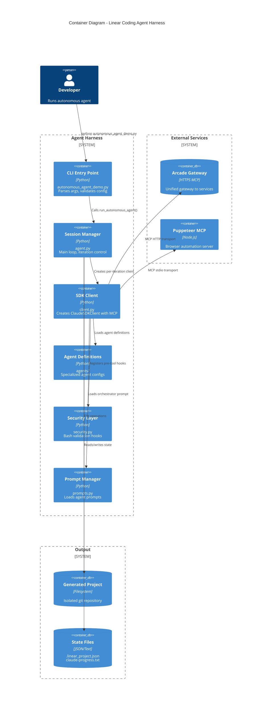
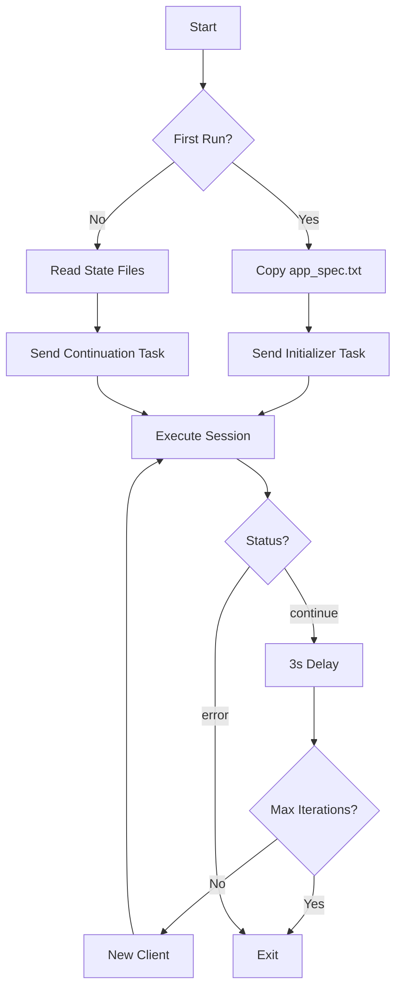
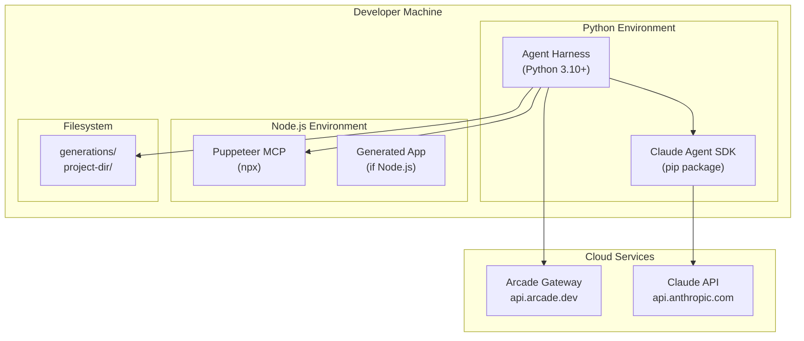

# Container Architecture

## Container Diagram



## Container Descriptions

### CLI Entry Point (`autonomous_agent_demo.py`)

**Purpose**: Command-line interface and initialization

**Responsibilities**:
- Parse command-line arguments (`--project-dir`, `--generations-base`, `--max-iterations`, `--model`)
- Validate required environment variables (`ARCADE_API_KEY`)
- Set up project directory structure
- Call main session loop

**Key Functions**:
- `parse_args()`: Argument parsing with defaults
- `main()`: Orchestrates initialization and error handling

### Session Manager (`agent.py`)

**Purpose**: Main agent session loop and iteration control

**Responsibilities**:
- Detect first-run vs continuation (via `.linear_project.json`)
- Create fresh client per iteration (context management)
- Select appropriate task prompts
- Handle session results and auto-continuation

**Key Functions**:
- `run_autonomous_agent()`: Main loop with iteration control
- `run_agent_session()`: Single session execution

**Session Flow**:


### SDK Client (`client.py`)

**Purpose**: Configure and create Claude Agent SDK client

**Responsibilities**:
- Create security settings with sandbox configuration
- Write `.claude_settings.json` to project
- Load orchestrator system prompt
- Configure MCP servers (Arcade HTTP, Puppeteer stdio)
- Register security hooks
- Load agent definitions

**Key Functions**:
- `create_client()`: Main factory function
- `create_security_settings()`: Security configuration
- `load_orchestrator_prompt()`: Prompt loading

### Agent Definitions (`agents/`)

**Purpose**: Define specialized agents with model and tool configuration

**Files**:
- `definitions.py`: Agent definitions with per-agent models
- `orchestrator.py`: Orchestrator session runner

**Agent Specifications**:
| Agent | Default Model | Tools |
|-------|---------------|-------|
| Orchestrator | Haiku | All agents via Task tool |
| Linear | Haiku | 39 Linear tools + File ops |
| Coding | Sonnet | File ops + Bash + Puppeteer |
| GitHub | Haiku | 46 GitHub tools + File ops + Bash |
| Slack | Haiku | 8 Slack tools + File ops |

### Security Layer (`security.py`)

**Purpose**: Pre-tool-use validation for bash commands

**Responsibilities**:
- Validate commands against allowlist (73 commands)
- Extra validation for sensitive commands (pkill, chmod, rm, init.sh)
- Block dangerous operations

**Allowlist Categories**:
- File inspection: ls, cat, head, tail, wc, grep, find
- File operations: cp, mv, mkdir, rm, touch, chmod, unzip
- Programming: python, python3, node, npm, npx
- Version control: git
- Network: curl
- Processes: ps, lsof, sleep, pkill (restricted)

### Prompt Manager (`prompts.py`)

**Purpose**: Load and construct agent prompts

**Responsibilities**:
- Load `.md` prompts from `prompts/` directory
- Construct task messages for first-run and continuation
- Copy app specification to project

**Prompt Files**:
- `orchestrator_prompt.md`: Orchestrator system prompt
- `linear_agent_prompt.md`: Linear agent instructions
- `coding_agent_prompt.md`: Coding agent instructions
- `github_agent_prompt.md`: GitHub agent instructions
- `slack_agent_prompt.md`: Slack agent instructions

### Arcade MCP Gateway

**Type**: External HTTP MCP server

**Purpose**: Unified access to Linear, GitHub, Slack APIs

**Configuration**:
```python
{
    "type": "http",
    "url": "https://api.arcade.dev/mcp/{gateway_slug}",
    "headers": {
        "Authorization": "Bearer {api_key}",
        "Arcade-User-ID": "{user_id}"
    }
}
```

**Tool Counts**: 93 total (39 Linear + 46 GitHub + 8 Slack)

### Puppeteer MCP Server

**Type**: Local stdio MCP server

**Purpose**: Browser automation for UI testing

**Configuration**:
```python
{
    "command": "npx",
    "args": ["puppeteer-mcp-server"]
}
```

**Tools**: navigate, screenshot, click, fill, select, hover, evaluate

### Generated Project

**Type**: Filesystem output

**Structure**:
```
generations/{project-name}/
├── .git/                    # Separate git repository
├── .linear_project.json     # Linear project state
├── .claude_settings.json    # Security settings
├── app_spec.txt             # Copied specification
├── claude-progress.txt      # Session progress cache
├── init.sh                  # Dev server startup
└── [application files]      # Generated code
```

## Deployment View



## Communication Patterns

| From | To | Protocol | Purpose |
|------|-----|----------|---------|
| CLI | Session Manager | Function call | Start loop |
| Session | Client | Function call | Per-iteration client |
| Client | Arcade | HTTPS MCP | Linear/GitHub/Slack |
| Client | Puppeteer | stdio MCP | Browser automation |
| Session | Filesystem | File I/O | State read/write |
| Security | Bash | Hook callback | Command validation |
