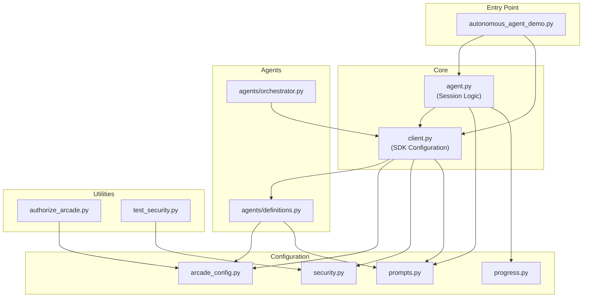
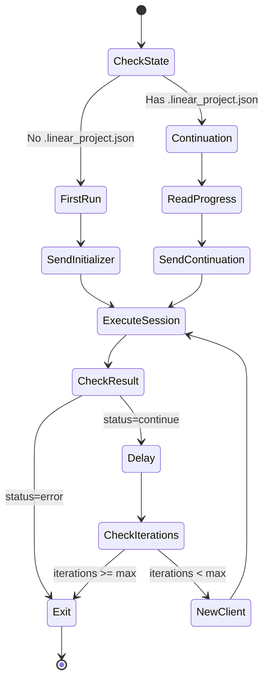
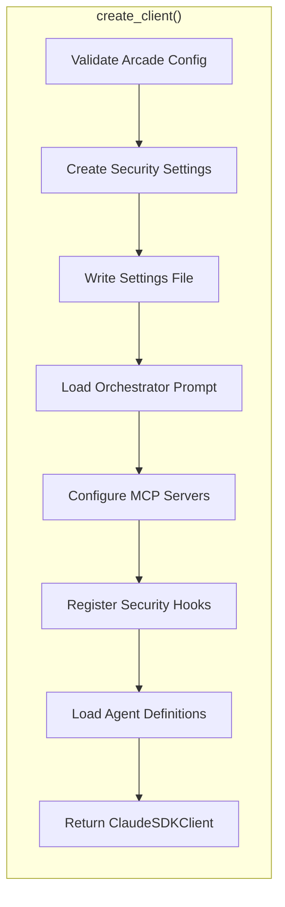
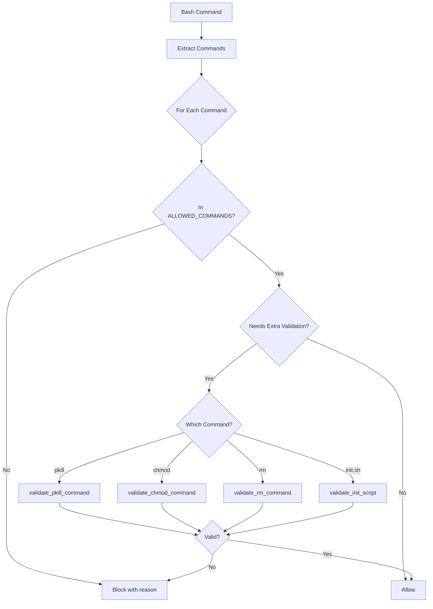

# Component Architecture

## Module Dependency Graph



## Module Specifications

### autonomous_agent_demo.py (185 lines)

**Purpose**: CLI entry point

**Dependencies**: `agent`, `client`, `dotenv`

**Key Functions**:

| Function | Parameters | Returns | Description |
|----------|------------|---------|-------------|
| `parse_args()` | - | `argparse.Namespace` | Parse CLI arguments |
| `main()` | - | `None` | Entry point with error handling |

**CLI Arguments**:
```
--project-dir    Project name or path (required logic via default)
--generations-base Base directory for projects
--max-iterations  Maximum agent iterations
--model          Orchestrator model (haiku/sonnet/opus)
```

### agent.py (294 lines)

**Purpose**: Core session logic and main loop

**Dependencies**: `client`, `prompts`, `progress`, `claude_agent_sdk`

**Types**:
```python
SessionStatus = Literal["continue", "error"]

class SessionResult(NamedTuple):
    status: SessionStatus
    response: str
```

**Key Functions**:

| Function | Parameters | Returns | Description |
|----------|------------|---------|-------------|
| `run_agent_session()` | `client`, `message` | `SessionResult` | Execute single session |
| `run_autonomous_agent()` | `project_dir`, `model`, `max_iterations` | `None` | Main iteration loop |

**Session State Machine**:


### client.py (219 lines)

**Purpose**: Claude SDK client configuration with security

**Dependencies**: `arcade_config`, `security`, `prompts`, `agents.definitions`, `claude_agent_sdk`

**Types**:
```python
class SecuritySettings(TypedDict):
    sandbox: SandboxConfig
    permissions: PermissionsConfig

class SandboxConfig(TypedDict):
    enabled: bool
    autoAllowBashIfSandboxed: bool

class PermissionsConfig(TypedDict):
    defaultMode: str  # "acceptEdits", "acceptAll", "reject", "ask"
    allow: list[str]
```

**Key Functions**:

| Function | Parameters | Returns | Description |
|----------|------------|---------|-------------|
| `create_security_settings()` | `project_dir` | `SecuritySettings` | Build security config |
| `write_security_settings()` | `project_dir`, `settings` | `None` | Write .claude_settings.json |
| `load_orchestrator_prompt()` | - | `str` | Load system prompt |
| `create_client()` | `project_dir`, `model` | `ClaudeSDKClient` | Main factory |

**Client Configuration**:


### security.py (516 lines)

**Purpose**: Bash command validation and security hooks

**Dependencies**: None (standalone)

**Types**:
```python
class ValidationResult(NamedTuple):
    allowed: bool
    reason: str = ""
```

**Constants**:
```python
ALLOWED_COMMANDS: set[str]  # 73 allowed bash commands
EXTRA_VALIDATION_COMMANDS: set[str]  # {pkill, chmod, init.sh, rm}
```

**Key Functions**:

| Function | Parameters | Returns | Description |
|----------|------------|---------|-------------|
| `extract_commands()` | `command` | `list[str]` | Parse compound commands |
| `split_command_segments()` | `command` | `list[str]` | Split on && and \|\| |
| `validate_pkill_command()` | `args` | `ValidationResult` | Only dev processes |
| `validate_chmod_command()` | `args` | `ValidationResult` | Only +x modes |
| `validate_rm_command()` | `args` | `ValidationResult` | Block system dirs |
| `validate_init_script()` | `command` | `ValidationResult` | Only ./init.sh |
| `bash_security_hook()` | `hook_input` | `dict` | Pre-tool-use callback |

**Validation Flow**:


### arcade_config.py (266 lines)

**Purpose**: Arcade MCP gateway configuration and tool definitions

**Dependencies**: None (standalone)

**Types**:
```python
class ArcadeMcpConfig(TypedDict):
    type: Literal["http"]
    url: str
    headers: dict[str, str]
```

**Tool Constants**:
```python
LINEAR_TOOLS: list[str]   # 39 tools
GITHUB_TOOLS: list[str]   # 46 tools
SLACK_TOOLS: list[str]    # 8 tools
```

**Key Functions**:

| Function | Parameters | Returns | Description |
|----------|------------|---------|-------------|
| `get_arcade_mcp_config()` | - | `ArcadeMcpConfig` | Build MCP config |
| `validate_arcade_config()` | - | `bool` | Validate env vars |
| `get_linear_tools()` | - | `list[str]` | Linear tool list |
| `get_github_tools()` | - | `list[str]` | GitHub tool list |
| `get_slack_tools()` | - | `list[str]` | Slack tool list |
| `get_coding_tools()` | - | `list[str]` | File + Puppeteer tools |

### progress.py (129 lines)

**Purpose**: Progress tracking and display

**Dependencies**: None (standalone)

**Types**:
```python
class LinearProjectState(TypedDict):
    initialized: bool
    created_at: str
    team_id: str
    project_id: str
    project_name: str
    meta_issue_id: str
    total_issues: int
    notes: NotRequired[str]
```

**Key Functions**:

| Function | Parameters | Returns | Description |
|----------|------------|---------|-------------|
| `load_linear_project_state()` | `project_dir` | `LinearProjectState \| None` | Load marker file |
| `is_linear_initialized()` | `project_dir` | `bool` | Check if initialized |
| `print_session_header()` | `iteration` | `None` | Display session header |
| `print_progress_summary()` | `state` | `None` | Display Linear status |

### prompts.py (213 lines)

**Purpose**: Prompt template loading and construction

**Dependencies**: None (standalone)

**Key Functions**:

| Function | Parameters | Returns | Description |
|----------|------------|---------|-------------|
| `load_prompt()` | `name` | `str` | Load .md from prompts/ |
| `get_initializer_task()` | `project_dir` | `str` | First-run task message |
| `get_continuation_task()` | `project_dir`, `state` | `str` | Continuation task message |
| `copy_spec_to_project()` | `project_dir` | `None` | Copy app_spec.txt |

### agents/definitions.py (143 lines)

**Purpose**: Agent definitions with model configuration

**Dependencies**: `arcade_config`, `prompts`

**Types**:
```python
ModelOption = Literal["haiku", "sonnet", "opus", "inherit"]
OrchestratorModelOption = Literal["haiku", "sonnet", "opus"]
```

**Constants**:
```python
DEFAULT_MODELS = {
    "linear": "haiku",
    "coding": "sonnet",
    "github": "haiku",
    "slack": "haiku"
}
```

**Key Functions**:

| Function | Parameters | Returns | Description |
|----------|------------|---------|-------------|
| `_get_model()` | `agent_name`, `default` | `ModelOption` | Read from env |
| `get_orchestrator_model()` | `cli_model` | `str` | Get orchestrator model |
| `_load_prompt()` | `name` | `str` | Load agent prompt |
| `create_agent_definitions()` | - | `dict[str, AgentDefinition]` | Build all agents |

### agents/orchestrator.py (108 lines)

**Purpose**: Orchestrator session execution

**Dependencies**: `client`, `claude_agent_sdk`

**Key Functions**:

| Function | Parameters | Returns | Description |
|----------|------------|---------|-------------|
| `run_orchestrated_session()` | `client`, `message`, `project_dir` | `SessionResult` | Execute orchestrated session |

## Code Organization

```
Linear-Coding-Agent-Harness/
├── autonomous_agent_demo.py    # Entry point (185 lines)
├── agent.py                    # Session logic (294 lines)
├── client.py                   # SDK configuration (219 lines)
├── security.py                 # Security hooks (516 lines)
├── progress.py                 # Progress tracking (129 lines)
├── prompts.py                  # Prompt loading (213 lines)
├── arcade_config.py            # Arcade config (266 lines)
├── authorize_arcade.py         # OAuth flow (192 lines)
├── test_security.py            # Security tests (324 lines)
├── agents/
│   ├── __init__.py
│   ├── definitions.py          # Agent definitions (143 lines)
│   └── orchestrator.py         # Orchestrator runner (108 lines)
├── prompts/
│   ├── app_spec.txt            # Application specification
│   ├── orchestrator_prompt.md  # Orchestrator system prompt
│   ├── linear_agent_prompt.md  # Linear agent prompt
│   ├── coding_agent_prompt.md  # Coding agent prompt
│   ├── github_agent_prompt.md  # GitHub agent prompt
│   └── slack_agent_prompt.md   # Slack agent prompt
└── requirements.txt            # Python dependencies
```

## Lines of Code Summary

| Module | Lines | Purpose |
|--------|-------|---------|
| security.py | 516 | Bash validation (largest) |
| test_security.py | 324 | Security tests |
| agent.py | 294 | Session logic |
| arcade_config.py | 266 | Tool definitions |
| client.py | 219 | SDK configuration |
| prompts.py | 213 | Prompt loading |
| authorize_arcade.py | 192 | OAuth flow |
| autonomous_agent_demo.py | 185 | CLI entry |
| agents/definitions.py | 143 | Agent definitions |
| progress.py | 129 | Progress tracking |
| agents/orchestrator.py | 108 | Orchestrator runner |
| **Total** | **~2,589** | Core application |
