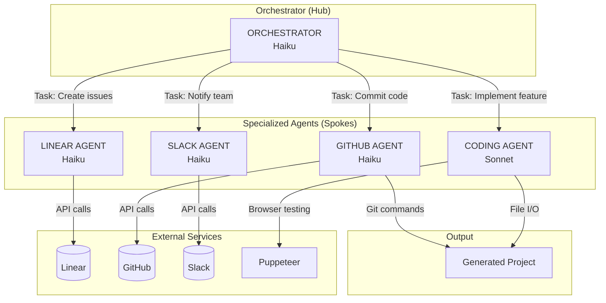
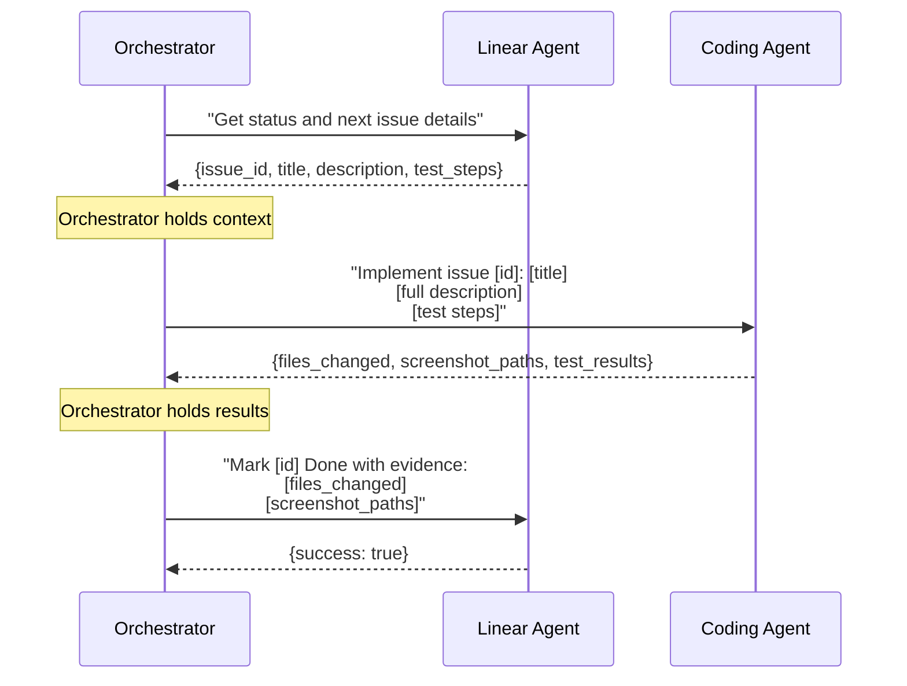
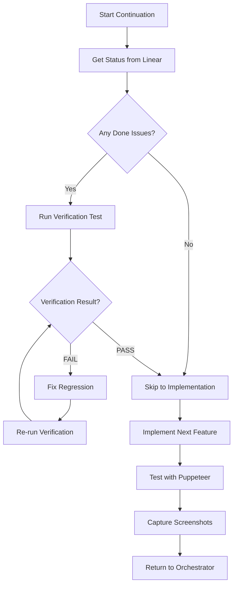
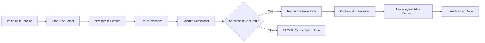
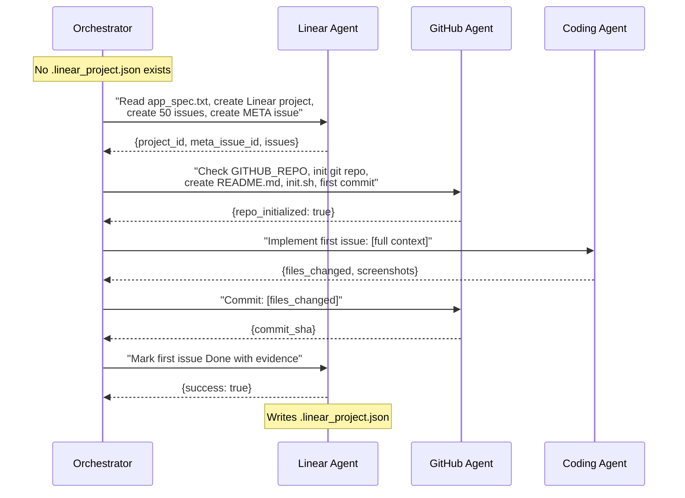
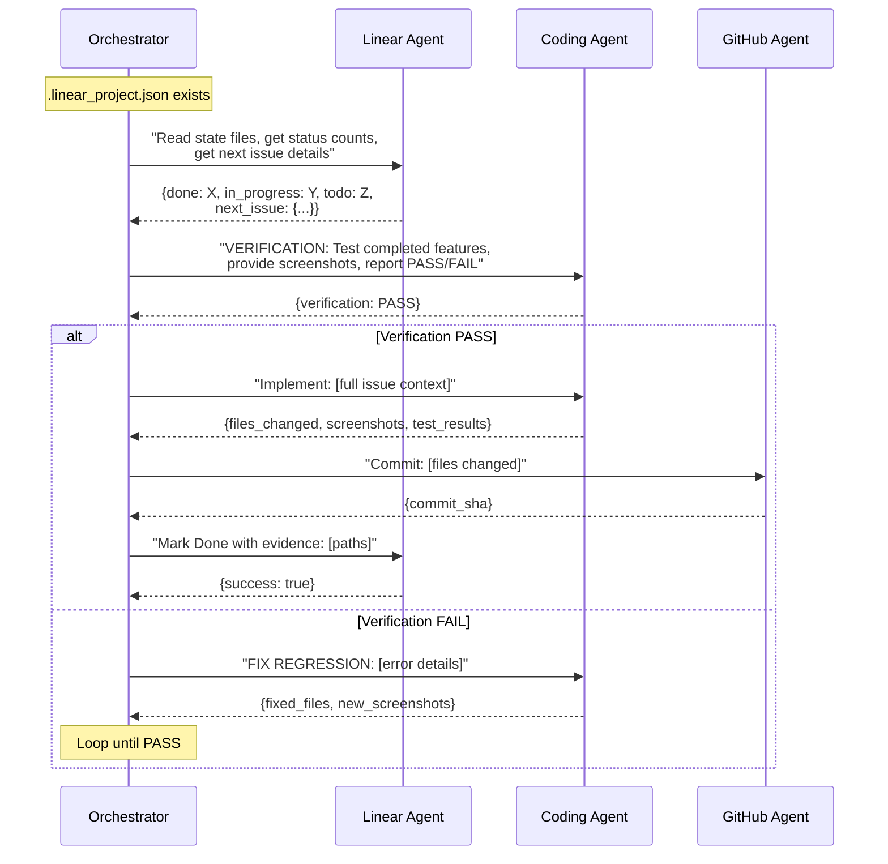
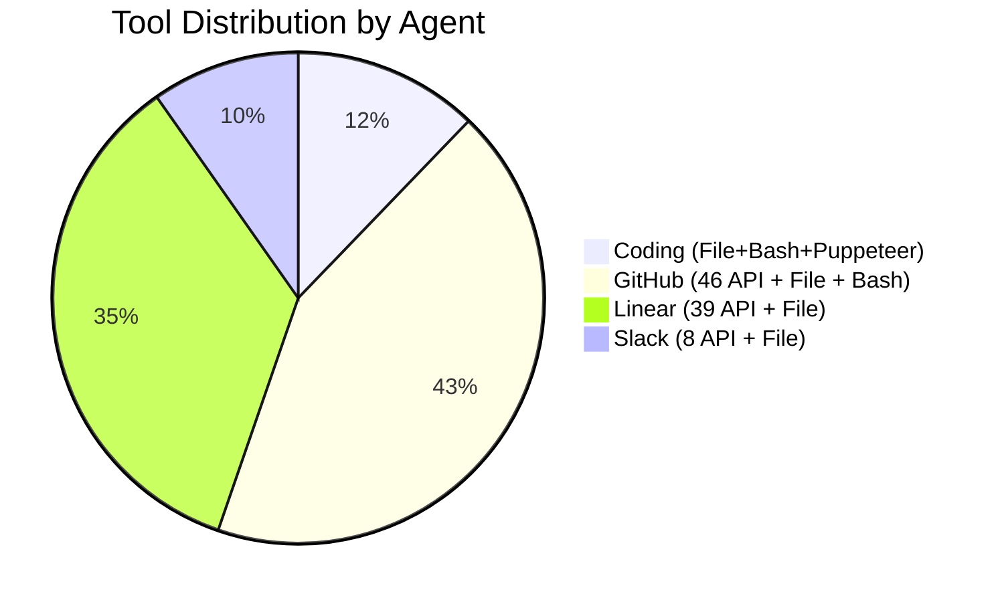

# Agent Architecture

## Multi-Agent Orchestration Pattern

The system uses a hub-and-spoke pattern where a central orchestrator delegates work to specialized agents. Agents do not share memory - all context must be explicitly passed.



## Agent Specifications

### Orchestrator Agent

| Attribute | Value |
|-----------|-------|
| **Model** | Haiku (default) |
| **Purpose** | Coordinate all work between specialized agents |
| **Prompt** | `prompts/orchestrator_prompt.md` (241 lines) |
| **Tools** | Task tool (delegates to other agents), file operations |

**Responsibilities**:
1. Read project state from `.linear_project.json` and `claude-progress.txt`
2. Query Linear agent for current status counts
3. Decide what work to do next
4. Delegate to specialized agents via Task tool
5. Pass full context between agents (never assume shared state)
6. Enforce verification gate before new work
7. Require screenshot evidence before marking issues Done

**Critical Rules** (from orchestrator prompt):
- Never skip verification test
- Never mark Done without screenshots
- Fix regressions before new work
- One issue at a time
- Pass full context (don't tell agents to "check" data you have)

### Linear Agent

| Attribute | Value |
|-----------|-------|
| **Model** | Haiku |
| **Purpose** | Issue and project management in Linear |
| **Prompt** | `prompts/linear_agent_prompt.md` |
| **Tools** | 39 Linear tools + File tools (Read, Write, Edit, Glob) |

**Responsibilities**:
1. Create Linear projects with proper structure
2. Create issues (50 by default) with detailed descriptions
3. Create META issue for session tracking
4. Manage issue status transitions (Todo → In Progress → Done)
5. Add implementation comments with evidence
6. Maintain `claude-progress.txt` for fast session reads
7. Write `.linear_project.json` marker file

**Linear Tools Used**:
- `Linear_CreateProject`: Create new project
- `Linear_CreateIssue`: Create individual issues
- `Linear_UpdateIssue`: Update issue details
- `Linear_TransitionIssueState`: Move status (Todo→InProgress→Done)
- `Linear_AddComment`: Add implementation notes
- `Linear_ListIssues`: Query issue status
- `Linear_GetIssue`: Get issue details

### Coding Agent

| Attribute | Value |
|-----------|-------|
| **Model** | Sonnet (most capable - needed for implementation) |
| **Purpose** | Implement features and test via Puppeteer |
| **Prompt** | `prompts/coding_agent_prompt.md` |
| **Tools** | File ops (Read, Write, Edit, Glob, Grep) + Bash + Puppeteer (7 tools) |

**Responsibilities**:
1. Implement features based on issue context passed by orchestrator
2. Run verification tests before new work (mandatory)
3. Test implementations via Puppeteer (mandatory)
4. Capture screenshot evidence (mandatory)
5. Report files changed and test results back to orchestrator

**Puppeteer Tools**:
- `puppeteer_navigate`: Go to URL (starts browser if needed)
- `puppeteer_screenshot`: Capture screenshot evidence
- `puppeteer_click`: Click elements by CSS selector
- `puppeteer_fill`: Fill form inputs
- `puppeteer_select`: Select dropdown options
- `puppeteer_hover`: Hover over elements
- `puppeteer_evaluate`: Run JavaScript in browser context

**Critical Constraint**: Always provide screenshot evidence before any issue can be marked Done.

### GitHub Agent

| Attribute | Value |
|-----------|-------|
| **Model** | Haiku |
| **Purpose** | Version control and PR management |
| **Prompt** | `prompts/github_agent_prompt.md` |
| **Tools** | 46 GitHub tools + File tools + Bash |
| **Activation** | Only if `GITHUB_REPO` env var is set |

**Responsibilities**:
1. Check GITHUB_REPO env var on first run
2. Initialize git repository if needed
3. Commit code changes with descriptive messages
4. Create feature branches
5. Push to remote
6. Create pull requests when features are ready

**GitHub Tools Used**:
- `Github_CreateBranch`: Create feature branch
- `Github_CreateOrUpdateFile`: Create/update files
- `Github_CreatePullRequest`: Open PR
- `Github_MergePullRequest`: Merge PR
- `Github_GetRepository`: Check repo exists
- Git commands via Bash: `git add`, `git commit`, `git push`

### Slack Agent

| Attribute | Value |
|-----------|-------|
| **Model** | Haiku |
| **Purpose** | Team notifications |
| **Prompt** | `prompts/slack_agent_prompt.md` |
| **Tools** | 8 Slack tools + File tools |
| **Activation** | Only if `SLACK_CHANNEL` env var is set |

**Responsibilities**:
1. Send progress notifications to configured channel
2. Notify on milestone completion
3. Report blockers or issues

**Slack Tools Used**:
- `Slack_SendMessage`: Send message to channel
- `Slack_ListConversations`: Find channel ID
- `Slack_GetConversationMetadata`: Verify channel exists

**Limitation**: Cannot create channels. Must use pre-existing channel.

## Agent Coordination Patterns

### Context Passing Pattern

Agents do not share memory. The orchestrator must pass full context between delegations.



**Anti-Pattern**: Never tell an agent to "check Linear" for data you already have. Pass the data directly.

### Verification Gate Pattern

Before any new feature work, completed features must be verified.



**Critical Rule**: Never skip verification. Never start new work if verification fails.

### Screenshot Evidence Pattern



**Critical Rule**: No screenshot = No Done status.

## Model Selection Strategy

| Agent | Default | Rationale |
|-------|---------|-----------|
| Orchestrator | Haiku | Simple coordination, cost-efficient |
| Linear | Haiku | API calls, text manipulation |
| Coding | Sonnet | Complex implementation, needs capability |
| GitHub | Haiku | Git commands, API calls |
| Slack | Haiku | Simple notifications |

**Override via Environment**:
```bash
ORCHESTRATOR_MODEL=opus     # More capable orchestration
LINEAR_AGENT_MODEL=sonnet   # More complex issue handling
CODING_AGENT_MODEL=opus     # Maximum implementation capability
GITHUB_AGENT_MODEL=sonnet   # Complex PR descriptions
SLACK_AGENT_MODEL=sonnet    # Richer notifications
```

## First-Run vs Continuation

### First Run Flow



### Continuation Flow



## Agent Definition Code Structure

```python
# agents/definitions.py

AGENT_DEFINITIONS = {
    "linear": AgentDefinition(
        name="linear",
        model=_get_model("linear", "haiku"),
        tools=get_linear_tools() + FILE_TOOLS,
        system_prompt=_load_prompt("linear_agent_prompt")
    ),
    "coding": AgentDefinition(
        name="coding",
        model=_get_model("coding", "sonnet"),
        tools=get_coding_tools(),  # File + Bash + Puppeteer
        system_prompt=_load_prompt("coding_agent_prompt")
    ),
    "github": AgentDefinition(
        name="github",
        model=_get_model("github", "haiku"),
        tools=get_github_tools() + FILE_TOOLS + ["Bash"],
        system_prompt=_load_prompt("github_agent_prompt")
    ),
    "slack": AgentDefinition(
        name="slack",
        model=_get_model("slack", "haiku"),
        tools=get_slack_tools() + FILE_TOOLS,
        system_prompt=_load_prompt("slack_agent_prompt")
    )
}
```

## Tool Distribution



| Agent | API Tools | Built-in Tools | Total |
|-------|-----------|----------------|-------|
| Linear | 39 | 4 (Read, Write, Edit, Glob) | 43 |
| Coding | 0 | 15 (File ops + Bash + Puppeteer) | 15 |
| GitHub | 46 | 6 (File ops + Bash) | 52 |
| Slack | 8 | 4 (File ops) | 12 |
