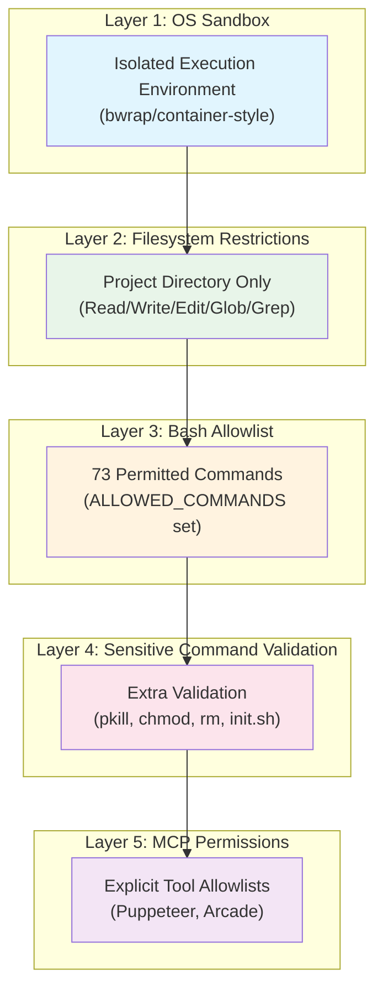
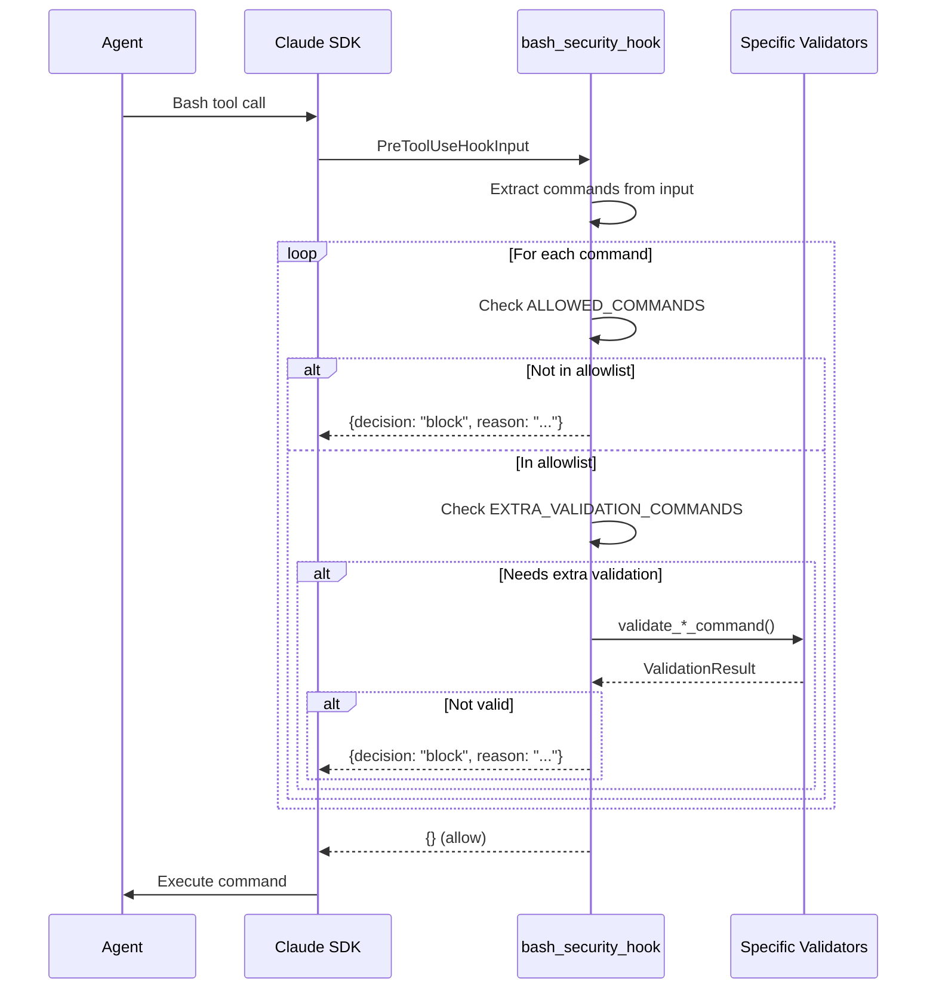
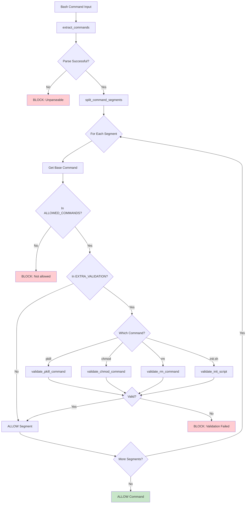

# Security Architecture

## Defense-in-Depth Model

The system implements five layers of security controls, each providing independent protection.



## Layer 1: OS-Level Sandbox

**Implementation**: Claude Agent SDK sandbox feature

**Configuration**:
```python
SandboxConfig(
    enabled=True,
    autoAllowBashIfSandboxed=True
)
```

**Protection**:
- Isolated process environment
- Restricted system calls
- Network isolation (configurable)
- Filesystem escape prevention

**Effect**: Commands run in a container-like environment with limited system access.

## Layer 2: Filesystem Restrictions

**Implementation**: Permission configuration in security settings

**Configuration**:
```python
PermissionsConfig(
    defaultMode="acceptEdits",
    allow=[
        "Read(./**)",      # Read files in project
        "Write(./**)",     # Write files in project
        "Edit(./**)",      # Edit files in project
        "Glob(./**)",      # Glob patterns in project
        "Grep(./**)",      # Search in project
        "Bash(*)",         # Bash allowed (validated by hooks)
        *PUPPETEER_TOOLS,  # Browser automation
        ARCADE_TOOLS       # External API access
    ]
)
```

**Protection**:
- All file operations restricted to project directory
- Cannot read/write outside `generations/{project-name}/`
- Glob patterns scoped to project
- Search restricted to project files

## Layer 3: Bash Command Allowlist

**Implementation**: Pre-tool-use hook in `security.py`

**Allowed Commands** (73 total):

| Category | Commands |
|----------|----------|
| File Inspection | ls, cat, head, tail, wc, grep, find |
| File Operations | cp, mv, mkdir, rm, touch, chmod, unzip |
| Navigation | pwd, cd |
| Text Processing | echo, printf |
| Network | curl |
| Environment | which, env |
| Python | python, python3 |
| Node.js | npm, npx, node |
| Version Control | git |
| Processes | ps, lsof, sleep, pkill |
| Scripts | init.sh |

**Blocked by Default**: Any command not in the allowlist

**Examples of Blocked Commands**:
- `sudo` - No privilege escalation
- `wget` - Use curl instead
- `ssh` - No remote access
- `su` - No user switching
- `docker` - No container management
- `mount` - No filesystem mounting
- `iptables` - No network configuration

## Layer 4: Sensitive Command Validation

Commands in `EXTRA_VALIDATION_COMMANDS` require additional checks.

### pkill Validation

**Purpose**: Prevent killing system processes

**Allowed Processes**:
- node
- npm
- npx
- vite
- next

**Blocked Processes**:
- bash, sh, zsh (shells)
- python, python3 (interpreters)
- chrome, firefox (browsers)
- Any system process

**Implementation**:
```python
def validate_pkill_command(args: list[str]) -> ValidationResult:
    allowed_processes = {'node', 'npm', 'npx', 'vite', 'next'}

    for arg in args:
        if arg.startswith('-'):
            continue
        if arg not in allowed_processes:
            return ValidationResult(
                False,
                f"pkill can only target: {allowed_processes}"
            )
    return ValidationResult(True)
```

### chmod Validation

**Purpose**: Restrict permission changes to execute only

**Allowed Modes**:
- `+x`, `u+x`, `g+x`, `o+x`, `a+x`
- Combinations: `ug+x`, `ugo+x`, etc.

**Blocked Modes**:
- Numeric: `777`, `755`, `644`
- Write/Read: `+w`, `+r`, `-x`
- Recursive: `-R`

**Implementation**:
```python
def validate_chmod_command(args: list[str]) -> ValidationResult:
    valid_mode_pattern = r'^[ugoa]*\+x$'

    for arg in args:
        if arg.startswith('-'):
            return ValidationResult(False, "chmod flags not allowed")
        if re.match(valid_mode_pattern, arg):
            continue  # Valid +x mode
        if arg.startswith('/') or arg.startswith('.'):
            continue  # File path
        return ValidationResult(False, f"Only +x modes allowed: {arg}")
    return ValidationResult(True)
```

### rm Validation

**Purpose**: Prevent deletion of system directories

**Blocked Paths**:
- Root: `/`
- System: `/etc`, `/usr`, `/var`, `/bin`, `/sbin`, `/lib`, `/opt`, `/boot`
- User: `/root`, `/home`, `/Users`
- macOS: `/System`, `/Library`, `/Applications`, `/private`
- Home shortcut: `~`

**Implementation**:
```python
def validate_rm_command(args: list[str]) -> ValidationResult:
    dangerous_paths = {
        '/', '/etc', '/usr', '/var', '/bin', '/sbin',
        '/lib', '/opt', '/boot', '/root', '/home',
        '/Users', '/System', '/Library', '/Applications',
        '/private', '~'
    }

    for arg in args:
        if arg.startswith('-'):
            continue

        normalized = os.path.normpath(arg)

        # Block exact matches
        if normalized in dangerous_paths:
            return ValidationResult(False, f"Cannot rm: {normalized}")

        # Block rm /* patterns
        if normalized.endswith('/*') and os.path.dirname(normalized) in dangerous_paths:
            return ValidationResult(False, f"Cannot rm: {arg}")

    return ValidationResult(True)
```

### init.sh Validation

**Purpose**: Only allow project init script

**Allowed**:
- `./init.sh`
- `path/to/project/init.sh`

**Blocked**:
- `./setup.sh`
- `./malicious.sh`
- `bash init.sh`
- `sh init.sh`

**Implementation**:
```python
def validate_init_script(command: str) -> ValidationResult:
    parts = command.strip().split()

    if len(parts) == 1:
        script = parts[0]
        if script == './init.sh' or script.endswith('/init.sh'):
            return ValidationResult(True)

    return ValidationResult(False, "Only ./init.sh allowed")
```

## Layer 5: MCP Permissions

**Purpose**: Explicit allowlisting of MCP tools

**Puppeteer Tools Allowed**:
```python
PUPPETEER_TOOLS = [
    "mcp__puppeteer__puppeteer_navigate",
    "mcp__puppeteer__puppeteer_screenshot",
    "mcp__puppeteer__puppeteer_click",
    "mcp__puppeteer__puppeteer_fill",
    "mcp__puppeteer__puppeteer_select",
    "mcp__puppeteer__puppeteer_hover",
    "mcp__puppeteer__puppeteer_evaluate"
]
```

**Arcade Tools Permission**:
```python
ARCADE_TOOLS_PERMISSION = "mcp__arcade__*"  # All Arcade tools
```

## Security Hook Architecture



## Security Settings File

Written to `.claude_settings.json` in project directory:

```json
{
  "sandbox": {
    "enabled": true,
    "autoAllowBashIfSandboxed": true
  },
  "permissions": {
    "defaultMode": "acceptEdits",
    "allow": [
      "Read(./**)",
      "Write(./**)",
      "Edit(./**)",
      "Glob(./**)",
      "Grep(./**)",
      "Bash(*)",
      "mcp__puppeteer__puppeteer_navigate",
      "mcp__puppeteer__puppeteer_screenshot",
      "mcp__puppeteer__puppeteer_click",
      "mcp__puppeteer__puppeteer_fill",
      "mcp__puppeteer__puppeteer_select",
      "mcp__puppeteer__puppeteer_hover",
      "mcp__puppeteer__puppeteer_evaluate",
      "mcp__arcade__*"
    ]
  }
}
```

## Threat Model

| Threat | Mitigation |
|--------|------------|
| Filesystem escape | Layer 2: Project directory restriction |
| System command execution | Layer 3: Bash allowlist |
| Process killing | Layer 4: pkill restricted to dev servers |
| Permission escalation | Layer 4: chmod restricted to +x |
| System directory deletion | Layer 4: rm path validation |
| Arbitrary script execution | Layer 4: Only ./init.sh allowed |
| Sandbox escape | Layer 1: OS-level isolation |
| Unauthorized API access | Layer 5: MCP tool allowlist |

## Validation Flow Diagram



## Security Testing

Located in `test_security.py` (324 lines):

**Test Categories**:
1. Command extraction tests
2. Allowlist validation tests
3. pkill validation tests
4. chmod validation tests
5. rm validation tests
6. init.sh validation tests
7. Compound command tests
8. Edge case tests

**Running Tests**:
```bash
python test_security.py
```

**Example Test Cases**:
```python
# Test pkill validation
assert validate_pkill_command(['node']).allowed == True
assert validate_pkill_command(['python']).allowed == False
assert validate_pkill_command(['-9', 'node']).allowed == True

# Test rm validation
assert validate_rm_command(['file.txt']).allowed == True
assert validate_rm_command(['/etc']).allowed == False
assert validate_rm_command(['/*']).allowed == False

# Test chmod validation
assert validate_chmod_command(['+x', 'script.sh']).allowed == True
assert validate_chmod_command(['777', 'script.sh']).allowed == False
```

## Customization

### Adding Allowed Commands

Edit `security.py`:
```python
ALLOWED_COMMANDS = {
    # ... existing commands ...
    'your_command',  # Add new command
}
```

### Adding Extra Validation

1. Add command to `EXTRA_VALIDATION_COMMANDS`
2. Create `validate_your_command()` function
3. Add case to `bash_security_hook()`:

```python
def validate_your_command(args: list[str]) -> ValidationResult:
    # Validation logic
    return ValidationResult(True)

# In bash_security_hook():
if base_cmd == 'your_command':
    result = validate_your_command(parts[1:])
    if not result.allowed:
        return {"decision": "block", "reason": result.reason}
```

### Modifying Filesystem Permissions

Edit `client.py`:
```python
def create_security_settings(project_dir: Path) -> SecuritySettings:
    return {
        "permissions": {
            "allow": [
                # Modify patterns here
                "Read(./**)",
                "Read(/additional/path/**)",  # Add more paths
            ]
        }
    }
```
