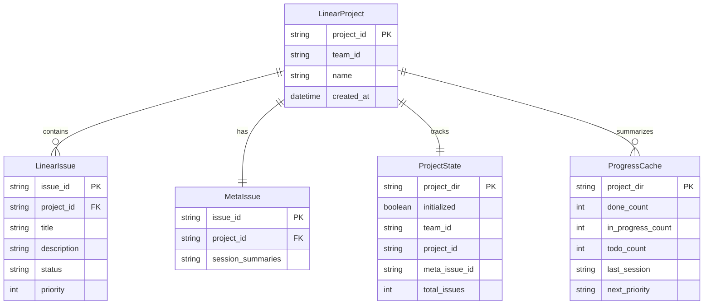
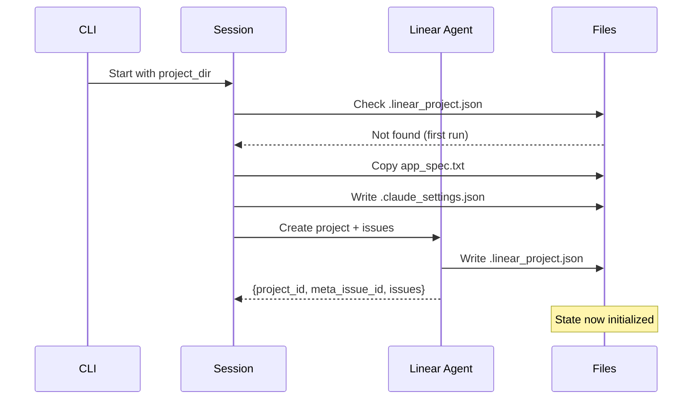
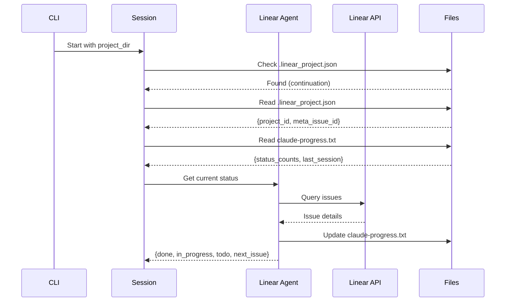
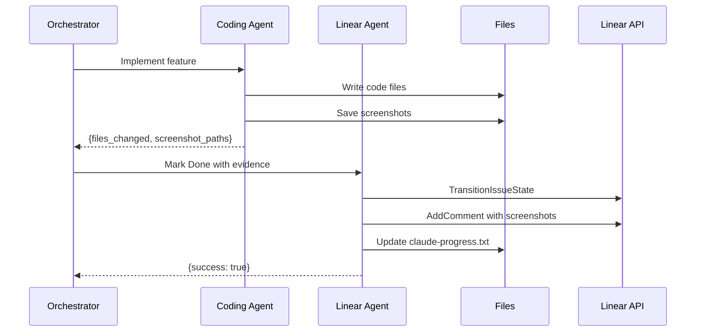
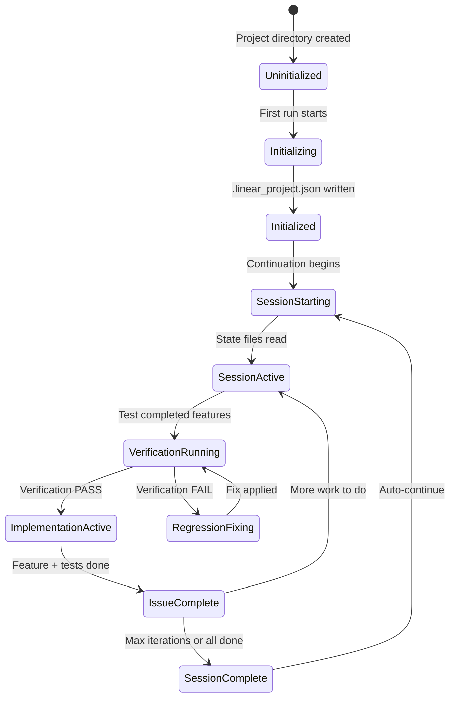
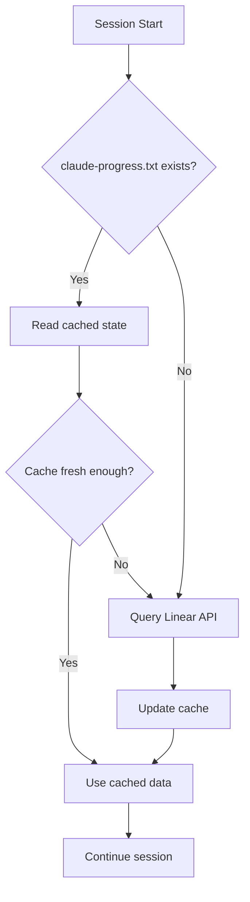
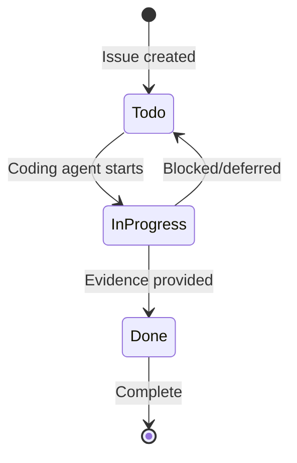

# Data Architecture

## Data Model Overview



## State Files

### .linear_project.json

**Purpose**: Primary project state marker and Linear ID storage

**Location**: `{project_dir}/.linear_project.json`

**Schema**:
```typescript
interface LinearProjectState {
    initialized: boolean;        // Always true when file exists
    created_at: string;          // ISO 8601 timestamp
    team_id: string;             // Linear team ID
    project_id: string;          // Linear project ID
    project_name: string;        // Human-readable name
    meta_issue_id: string;       // META issue identifier (e.g., "APP-1")
    total_issues: number;        // Number of issues created
    notes?: string;              // Optional session notes
}
```

**Example**:
```json
{
    "initialized": true,
    "created_at": "2025-01-27T10:30:00Z",
    "team_id": "team-abc123",
    "project_id": "proj-xyz789",
    "project_name": "My Web App",
    "meta_issue_id": "APP-1",
    "total_issues": 50
}
```

**Lifecycle**:
1. **Creation**: Written by Linear agent after creating project and META issue
2. **Reading**: Checked on session start to determine first-run vs continuation
3. **Update**: Rarely updated (only if notes added)

### claude-progress.txt

**Purpose**: Fast session context cache (avoids API calls)

**Location**: `{project_dir}/claude-progress.txt`

**Format**:
```markdown
# Project Progress

## Current Status
- Done: {X} issues
- In Progress: {Y} issues
- Todo: {Z} issues

## Last Session ({YYYY-MM-DD})
- Completed: {issue title}
- Working on: {issue title}
- Notes: {context}

## Next Priority
- Issue: {id} - {title}
- Description: {brief description}
- Test Steps: {list of steps}
```

**Example**:
```markdown
# Project Progress

## Current Status
- Done: 12 issues
- In Progress: 1 issues
- Todo: 37 issues

## Last Session (2025-01-27)
- Completed: User login form
- Working on: Dashboard layout
- Notes: Need to add responsive breakpoints

## Next Priority
- Issue: APP-14 - Implement user profile page
- Description: Create profile page with avatar, name, and settings
- Test Steps:
  1. Navigate to /profile
  2. Verify avatar displays
  3. Verify name field is editable
```

**Lifecycle**:
1. **Creation**: Written by Linear agent after first issue completion
2. **Update**: Updated after each issue state change
3. **Reading**: Read by orchestrator at session start for quick context

### .claude_settings.json

**Purpose**: Security configuration for the project

**Location**: `{project_dir}/.claude_settings.json`

**Schema**:
```typescript
interface ClaudeSettings {
    sandbox: {
        enabled: boolean;
        autoAllowBashIfSandboxed: boolean;
    };
    permissions: {
        defaultMode: "acceptEdits" | "acceptAll" | "reject" | "ask";
        allow: string[];  // Tool permission patterns
    };
}
```

**Example**:
```json
{
    "sandbox": {
        "enabled": true,
        "autoAllowBashIfSandboxed": true
    },
    "permissions": {
        "defaultMode": "acceptEdits",
        "allow": [
            "Read(./**)",
            "Write(./**)",
            "Edit(./**)",
            "Glob(./**)",
            "Grep(./**)",
            "Bash(*)",
            "mcp__puppeteer__puppeteer_navigate",
            "mcp__puppeteer__puppeteer_screenshot",
            "mcp__puppeteer__puppeteer_click",
            "mcp__puppeteer__puppeteer_fill",
            "mcp__puppeteer__puppeteer_select",
            "mcp__puppeteer__puppeteer_hover",
            "mcp__puppeteer__puppeteer_evaluate",
            "mcp__arcade__*"
        ]
    }
}
```

**Lifecycle**:
1. **Creation**: Written by `create_client()` on every session start
2. **Reading**: Read by Claude Agent SDK for permission enforcement
3. **Immutable**: Not modified during session

## Data Flow Patterns

### First Run Data Flow



### Continuation Data Flow



### Issue Completion Data Flow



## Context Passing Data Structures

### Issue Context (Linear → Orchestrator)

```typescript
interface IssueContext {
    issue_id: string;          // e.g., "APP-15"
    title: string;             // e.g., "Implement user profile page"
    description: string;       // Full description from Linear
    test_steps: string[];      // How to verify implementation
    priority: number;          // 1 (highest) to 4 (lowest)
    status: "Todo" | "InProgress" | "Done";
}
```

### Implementation Result (Coding → Orchestrator)

```typescript
interface ImplementationResult {
    files_changed: string[];          // ["src/pages/Profile.tsx", "src/styles/profile.css"]
    screenshot_paths: string[];       // ["screenshots/APP-15-profile.png"]
    test_results: {
        passed: boolean;
        details: string;
    };
    verification: "PASS" | "FAIL";
}
```

### Status Summary (Linear → Orchestrator)

```typescript
interface StatusSummary {
    done: number;
    in_progress: number;
    todo: number;
    next_issue: IssueContext | null;
    meta_issue_updates: string;
}
```

## State Transitions



## File System Layout

```
generations/
└── my-project/
    ├── .git/                      # Git repository
    │   └── ...
    │
    ├── .linear_project.json       # Project state (JSON)
    ├── .claude_settings.json      # Security settings (JSON)
    ├── claude-progress.txt        # Progress cache (Markdown)
    │
    ├── app_spec.txt               # Copied specification
    ├── init.sh                    # Dev server startup script
    ├── README.md                  # Project documentation
    │
    ├── screenshots/               # Evidence directory
    │   ├── APP-1-initial-setup.png
    │   ├── APP-2-login-form.png
    │   └── ...
    │
    ├── src/                       # Application source
    │   ├── pages/
    │   ├── components/
    │   └── ...
    │
    └── package.json               # Dependencies (if Node.js)
```

## Data Retention

| Data | Lifetime | Purpose |
|------|----------|---------|
| .linear_project.json | Project lifetime | State marker |
| claude-progress.txt | Session to session | Quick context |
| .claude_settings.json | Session | Security config |
| Screenshots | Project lifetime | Completion evidence |
| Git history | Project lifetime | Code versioning |
| Linear issues | External | Work tracking |

## Caching Strategy

### Problem: API Call Reduction

Each session start requires understanding project state. Without caching, this requires multiple Linear API calls.

### Solution: claude-progress.txt

The `claude-progress.txt` file caches:
1. Issue status counts
2. Last session summary
3. Next priority issue details

**Cache Invalidation**: Updated after every issue state change by Linear agent.

**Cache Miss Handling**: If file missing or stale, Linear agent queries API and regenerates.



## External Data (Linear)

### Project Structure in Linear

```
Team (e.g., "Engineering")
└── Project (e.g., "My Web App")
    ├── META Issue (APP-1)
    │   └── Session summaries as comments
    │
    ├── Feature Issue (APP-2)
    │   └── Implementation comments + screenshot links
    │
    ├── Feature Issue (APP-3)
    │   └── ...
    │
    └── ... (up to 50 issues)
```

### Issue State Machine in Linear


