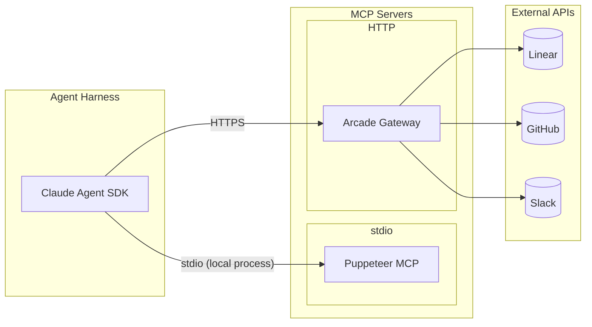
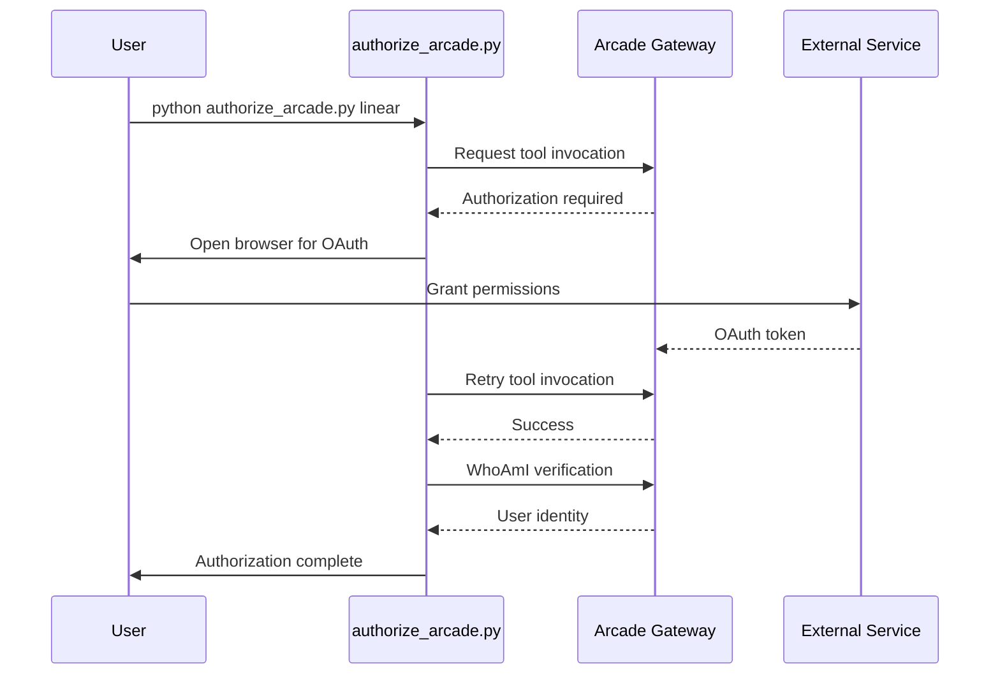
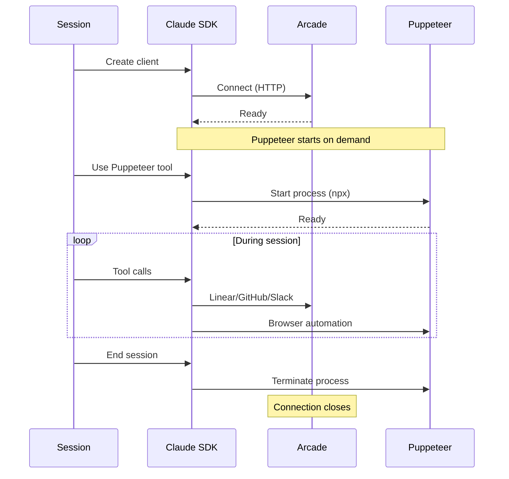

# MCP Integration Architecture

## Overview

The system uses two MCP (Model Context Protocol) servers:
1. **Arcade Gateway** (HTTP): Unified access to Linear, GitHub, Slack
2. **Puppeteer** (stdio): Local browser automation



## Arcade MCP Gateway

### Configuration

```python
{
    "type": "http",
    "url": "https://api.arcade.dev/mcp/{ARCADE_GATEWAY_SLUG}",
    "headers": {
        "Authorization": "Bearer {ARCADE_API_KEY}",
        "Arcade-User-ID": "{ARCADE_USER_ID}"
    }
}
```

### Environment Variables

| Variable | Required | Description |
|----------|----------|-------------|
| `ARCADE_API_KEY` | Yes | API key (starts with `arc_`) |
| `ARCADE_GATEWAY_SLUG` | Yes | Gateway identifier |
| `ARCADE_USER_ID` | No | User email for tracking |

### Tool Categories

#### Linear Tools (39 total)

**Query Tools**:
| Tool | Description |
|------|-------------|
| `Linear_WhoAmI` | Get authenticated user info |
| `Linear_GetTeam` | Get team details |
| `Linear_ListTeams` | List all teams |
| `Linear_ListProjects` | List projects in team |
| `Linear_GetProject` | Get project details |
| `Linear_ListIssues` | List issues with filters |
| `Linear_GetIssue` | Get single issue |
| `Linear_GetNotifications` | Get user notifications |

**Mutation Tools**:
| Tool | Description |
|------|-------------|
| `Linear_CreateProject` | Create new project |
| `Linear_UpdateProject` | Update project details |
| `Linear_CreateIssue` | Create new issue |
| `Linear_UpdateIssue` | Update issue fields |
| `Linear_TransitionIssueState` | Change issue status |
| `Linear_AddComment` | Add comment to issue |
| `Linear_CreateLabel` | Create issue label |
| `Linear_AddLabelToIssue` | Apply label to issue |

**Authorization Required**:
- `Linear_CreateProject`
- `Linear_CreateIssue`
- `Linear_UpdateIssue`
- `Linear_TransitionIssueState`
- `Linear_AddComment`

#### GitHub Tools (46 total)

**Repository Tools**:
| Tool | Description |
|------|-------------|
| `Github_WhoAmI` | Get authenticated user |
| `Github_GetRepository` | Get repo details |
| `Github_SearchMyRepos` | Search user's repos |
| `Github_GetFileContents` | Read file content |
| `Github_ListDirectory` | List directory contents |

**Issue Tools**:
| Tool | Description |
|------|-------------|
| `Github_ListIssues` | List repo issues |
| `Github_GetIssue` | Get single issue |
| `Github_CreateIssue` | Create new issue |
| `Github_CreateIssueComment` | Comment on issue |

**Branch and Commit Tools**:
| Tool | Description |
|------|-------------|
| `Github_ListBranches` | List branches |
| `Github_CreateBranch` | Create new branch |
| `Github_CreateOrUpdateFile` | Create/update file |
| `Github_DeleteFile` | Delete file |

**Pull Request Tools**:
| Tool | Description |
|------|-------------|
| `Github_ListPullRequests` | List PRs |
| `Github_GetPullRequest` | Get PR details |
| `Github_CreatePullRequest` | Create new PR |
| `Github_UpdatePullRequest` | Update PR |
| `Github_MergePullRequest` | Merge PR |
| `Github_ListPullRequestCommits` | List PR commits |
| `Github_ListPullRequestFiles` | List changed files |

**Authorization Required**:
- `Github_CreateBranch`
- `Github_CreatePullRequest`
- `Github_UpdatePullRequest`
- `Github_MergePullRequest`
- `Github_CreateIssueComment`
- `Github_CreateOrUpdateFile`

#### Slack Tools (8 total)

| Tool | Description |
|------|-------------|
| `Slack_WhoAmI` | Get bot identity |
| `Slack_GetUsersInfo` | Get user details |
| `Slack_ListUsers` | List workspace users |
| `Slack_ListConversations` | List channels |
| `Slack_GetConversationMetadata` | Get channel info |
| `Slack_GetChannelHistory` | Get message history |
| `Slack_GetThreadReplies` | Get thread replies |
| `Slack_SendMessage` | Send message |

**Authorization Required**:
- `Slack_SendMessage`

### Authorization Flow



**Running Authorization**:
```bash
# All services
python authorize_arcade.py

# Individual services
python authorize_arcade.py linear
python authorize_arcade.py github
python authorize_arcade.py slack
```

## Puppeteer MCP Server

### Configuration

```python
{
    "command": "npx",
    "args": ["puppeteer-mcp-server"]
}
```

### Transport

- **Type**: stdio (standard input/output)
- **Process**: Local Node.js process
- **Lifecycle**: Started when tools first used, persists for session

### Tools

| Tool | Parameters | Description |
|------|------------|-------------|
| `puppeteer_navigate` | `url: string` | Navigate to URL (starts browser) |
| `puppeteer_screenshot` | `name?: string` | Capture full page screenshot |
| `puppeteer_click` | `selector: string` | Click element by CSS selector |
| `puppeteer_fill` | `selector: string, value: string` | Fill input field |
| `puppeteer_select` | `selector: string, value: string` | Select dropdown option |
| `puppeteer_hover` | `selector: string` | Hover over element |
| `puppeteer_evaluate` | `script: string` | Execute JavaScript in page |

### Usage Patterns

#### Starting Dev Server and Testing

```python
# 1. Start development server
Bash: "npm run dev &"

# 2. Wait for server
Bash: "sleep 3"

# 3. Navigate to app
puppeteer_navigate: {"url": "http://localhost:3000"}

# 4. Capture initial state
puppeteer_screenshot: {"name": "initial-load"}

# 5. Interact with UI
puppeteer_click: {"selector": "#login-button"}
puppeteer_fill: {"selector": "#email", "value": "test@example.com"}
puppeteer_fill: {"selector": "#password", "value": "password123"}
puppeteer_click: {"selector": "#submit"}

# 6. Capture result
puppeteer_screenshot: {"name": "after-login"}
```

#### Verification Testing

```python
# Test completed features before new work
puppeteer_navigate: {"url": "http://localhost:3000"}

# Test feature 1
puppeteer_click: {"selector": "#feature-1-trigger"}
puppeteer_screenshot: {"name": "feature-1-test"}

# Test feature 2
puppeteer_navigate: {"url": "http://localhost:3000/feature-2"}
puppeteer_screenshot: {"name": "feature-2-test"}

# Report: PASS or FAIL
```

### Screenshot Evidence

Screenshots are saved to `{project_dir}/screenshots/`:

```
screenshots/
├── APP-1-initial-setup.png
├── APP-2-login-form.png
├── APP-3-dashboard.png
└── verification-{date}.png
```

## Tool Permission Mapping

### Agent Tool Access

| Agent | Arcade Tools | Puppeteer | Bash | File Ops |
|-------|--------------|-----------|------|----------|
| Orchestrator | Via delegation | No | No | Read only |
| Linear | 39 Linear | No | No | Yes |
| Coding | No | 7 tools | Yes | Yes |
| GitHub | 46 GitHub | No | Yes | Yes |
| Slack | 8 Slack | No | No | Yes |

### Permission Configuration

```python
# client.py - Tool permissions
PUPPETEER_TOOLS = [
    "mcp__puppeteer__puppeteer_navigate",
    "mcp__puppeteer__puppeteer_screenshot",
    "mcp__puppeteer__puppeteer_click",
    "mcp__puppeteer__puppeteer_fill",
    "mcp__puppeteer__puppeteer_select",
    "mcp__puppeteer__puppeteer_hover",
    "mcp__puppeteer__puppeteer_evaluate"
]

ARCADE_TOOLS_PERMISSION = "mcp__arcade__*"

# All tools explicitly allowed in security settings
permissions["allow"] = [
    *PUPPETEER_TOOLS,
    ARCADE_TOOLS_PERMISSION,
    # ... file ops ...
]
```

## Error Handling

### Arcade Errors

| Error | Cause | Resolution |
|-------|-------|------------|
| 401 Unauthorized | Invalid API key | Check ARCADE_API_KEY |
| 403 Forbidden | Missing authorization | Run authorize_arcade.py |
| 404 Not Found | Invalid gateway slug | Check ARCADE_GATEWAY_SLUG |
| 429 Rate Limited | Too many requests | Implement backoff |

### Puppeteer Errors

| Error | Cause | Resolution |
|-------|-------|------------|
| Navigation timeout | Server not started | Start dev server first |
| Element not found | Invalid selector | Check CSS selector |
| Browser crash | Resource exhaustion | Restart session |

## MCP Server Lifecycle



## Troubleshooting

### Arcade Connection Issues

```bash
# Verify API key
echo $ARCADE_API_KEY | head -c 10  # Should show "arc_..."

# Verify gateway exists
curl -H "Authorization: Bearer $ARCADE_API_KEY" \
     https://api.arcade.dev/mcp/$ARCADE_GATEWAY_SLUG

# Re-authorize if needed
python authorize_arcade.py
```

### Puppeteer Issues

```bash
# Verify npx works
npx puppeteer-mcp-server --help

# Check Node.js version
node --version  # Should be 16+

# Clear npm cache if issues
npm cache clean --force
```

### Common Fixes

1. **"Authorization required"**: Run `python authorize_arcade.py {service}`
2. **"Gateway not found"**: Verify `ARCADE_GATEWAY_SLUG` matches dashboard
3. **"Browser timeout"**: Ensure dev server is running before Puppeteer
4. **"Tool not found"**: Check tool is added to Arcade gateway dashboard
